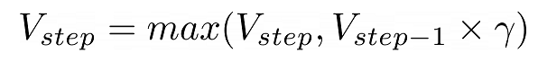
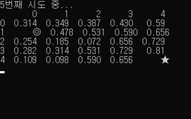

# random_navigate_agent
무작위성 길찾기 에이전트

## 규칙
- 맵은 (map_size, map_size) 크기의 정사각형 형태임.
- agent는 **항상** 무작위 4방향으로 움직임.
- 항상 (0,0) 위치에서 agent는 길찾기를 시작함.
- 항상 (map_size-1, map_size-1) 위치가 agent의 목적지임.
- 맵에서 agent는 `◎`, 목적지는 `★`으로 표현됨.
- 맵은 각 위치별로 0 ~ 1 사이의 값을 가지며, 이는 가치함수를 통한 기댓값(reward)으로 해석할 수 있음.
- agent가 목적지에 도착한 경우, 지나온 경로에 대해 아래 수식을 통해 reward를 업데이트함.
  - 
    - V : value function
    - step : count of navigate route
    - γ : discount rate


## 실행 화면


- `map_size=5` 인 경우 약 10번 이내에 수렴됨.

## 실행 환경
- python >= 3.6
- argparse
- os
- random
- time
- numpy
- pandas (for display)

## 실행 커맨드
- display 목적
  - `python demo.py --map_size 5 --discount_rate 0.9 --display_sleep 0.1 --update_sleep 1`

- 빠른 수렴 목적
  - ```python demo.py --map_size 5 --discount_rate 0.9 --display_sleep 0 --update_sleep 1```

## 참고자료
https://greentec.github.io/reinforcement-learning-first
